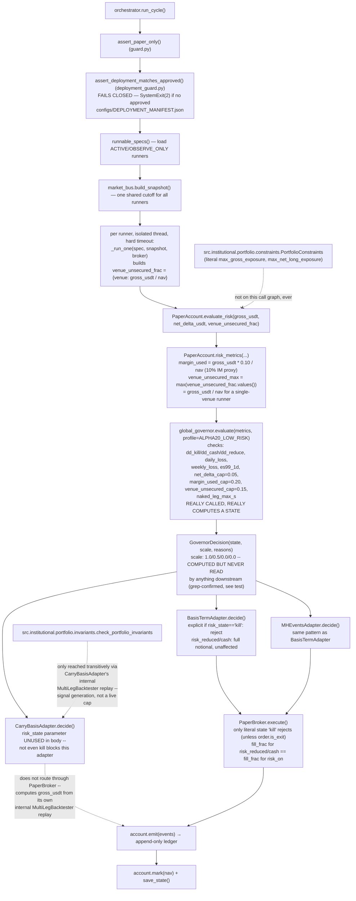

# V2 Phase 1 Diagnostic (2026-07-27)

Diagnostic only, per the session's explicit instruction: nothing here was
fixed. All commands below were actually executed with the interpreter
pinned in `docs/v2/INTERPRETER.md`
(`/opt/homebrew/Caskroom/miniconda/base/bin/python3`, 3.12.2). Repo state:
branch `v2/foundation`, starting commit `8ceaaf1` (source-review addendum),
itself on top of `d5e27b2` / forensic tag `forensic-baseline-2026-07-27` at
`ecd93ad`.

## 1. `tests/` (root suite)

**Updated 2026-07-27, session 3, Commit 3** — the numbers in this section
were re-run after fixing the 3 orchestrator tests (see the bullet below and
`docs/v2/EXECUTION_STATE.md`'s Commit 3 entry). Original session-1 numbers
struck through where superseded.

```
$ python3 -m pytest tests/ -ra --tb=short -q
... 4 errors during collection, pytest aborts (exit 2) before running anything
```

Default pytest behavior aborts the whole run on collection errors. Re-ran
with `--continue-on-collection-errors` to get a full picture in one pass:

```
$ python3 -m pytest tests/ -ra --tb=short -q --continue-on-collection-errors
6 failed, 376 passed, 21 warnings, 4 errors in 15.91s   (exit 1)
```
(was: `9 failed, 361 passed, 21 warnings, 4 errors in 14.98s` before Commit
2's 12 new diagnostic tests and Commit 3's orchestrator fix — net +15
passed / -3 failed, reconciled below.)

**4 collection errors — genuinely missing modules, not an environment
problem:**

| test file | imports | verified absent |
|---|---|---|
| `tests/test_cross_exchange.py` | `src.institutional.data.derivatives` | not in git history on any branch (`git log --all`), not under `legacy/` |
| `tests/test_cross_exchange_funding_edge.py` | `src.institutional.data.derivatives.features.cross_exchange_features` | same |
| `tests/test_fold_aware_loader.py` | (via `scripts/run_backtest_engine.py`) `src.institutional.data.loaders` | same |
| `tests/test_news_collector.py` | `src.institutional.data.news_collector.lexicon` | same |

`src/institutional/data/` on disk contains only `positioning_archiver.py`
and `atomic_parquet.py` — these four modules were never committed at this
path on this repo, on any branch.

**6 failures (was 9), two remaining root causes — the third was fixed this
session:**

- **4×** `tests/test_derivatives_collector.py` — same missing-module cause
  as above (`src.institutional.data.derivatives_collector`), but the import
  is inside the test function rather than at module top level, so pytest
  collects the file and fails each test individually instead of one
  collection error.
- ~~**3×** `tests/test_alpha20_tournament_orchestrator.py`~~ **FIXED,
  Commit 3.** Was: `SystemExit: 2` raised by
  `src/alpha20/deployment_guard.py:60`, message: *"DEPLOYMENT GUARD — aucun
  manifeste approuvé trouvé (configs/DEPLOYMENT_MANIFEST.json). Démarrage
  refusé."* — the fail-closed deployment-drift guard (git log `eb94ddf`)
  doing exactly what it's designed to do, but these 3 tests didn't
  mock/bypass it. Fixed by adding
  `monkeypatch.setattr(orchestrator, "assert_deployment_matches_approved", lambda: None)`
  to the `no_network` fixture — not a global fake manifest, since
  `tests/test_alpha20_deployment_guard.py` already independently covers the
  fail-closed behavior itself (re-run and confirmed still 4/4 passing after
  this change, so the guard's own test coverage wasn't weakened). Now
  `test_alpha20_tournament_orchestrator.py`: `5 passed in 1.50s`.
- **2×** `tests/test_hedge_governor_backtest.py`,
  `tests/test_portfolio_multileg.py` — `ValueError: no prices`, caused by
  `data/enriched/BTCUSDT_1h_enriched.parquet` and `ETHUSDT_1h_enriched.parquet`
  being absent on this machine. Consistent with prior-session memory: this
  Mac has no local enriched historical dataset (it lives on
  `qbee@100.127.59.114`). **Data-locality gap, not a code bug.**

Plus **12 new passing tests** from
`tests/test_v2_phase1_live_exposure_cap_diagnostic.py` (Commit 2, section 4
below) — accounts for the rest of the +15 passed delta (3 orchestrator + 12
diagnostic = 15).

## 2. `trading-system/tests/`

Re-run in session 3, Commit 3, for completeness — **unchanged**, as
expected (nothing this session touched `trading-system/`):

```
$ cd trading-system && python3 -m pytest tests/ -ra --tb=short -q --continue-on-collection-errors
collected 16 items / 4 errors
5 failed, 4 passed, 7 skipped, 4 errors in 2.34s   (exit 1)
```

All 4 collection errors and 3 of the 5 failures are `ModuleNotFoundError:
No module named 'institutional.data'` — a **different package root** than
the primary suite (`institutional.*`, from `trading-system/pyproject.toml`'s
`institutional` package, vs. `src.institutional.*` at repo root). One
failure (`test_partial_failed_message_when_asset_fails`) chains into the
root-level `scripts/build_engine_datasets.py`, which itself fails on
`src.institutional.data.dataset_builder` — another genuinely-missing module,
same pattern as section 1. 7 skips are explicit ("Données enriched BTC/ETH
absentes") — same data-locality gap as above, handled with a real skip
rather than a silent pass, which is the correct behavior.

This confirms two independent, differently-rooted `institutional` packages
exist in the repo (root `src/institutional/` vs.
`trading-system/src/institutional/`, imported as `institutional.*` from
that subproject's own `pyproject.toml`) — consistent with the
`MIGRATION.md` UNVERIFIED classification of `trading-system/` and a
concrete instance of the master prompt's "generations incompatibles" claim.

## 3. Live/paper decision path: `src/alpha20` → exposure control → order

Traced by reading, then confirmed by the executable tests in section 4.
**Section 4 below corrects an error in this section's first version** (see
that section's opening note) — the diagram and facts here are the corrected
version.



Key facts (all confirmed by reading the actual code AND by the executable
tests in section 4 — not inferred):

- `orchestrator._run_one` (not `risk_metrics` in isolation) builds
  `venue_unsecured_frac = {spec.venue or "n/a": gross_usdt / max(nav, 1.0)}`
  — so `gross_usdt` **does** flow into the governor via two routes: the
  `margin_used` proxy (10% of gross) and, for a single-venue runner, the
  entire `venue_unsecured_max` check (`gross_usdt / nav` directly, no
  10% haircut). There is still no `gross_usdt / nav <= max_gross_exposure`
  comparison anywhere — but `venue_unsecured_cap=0.15` acts as a much
  *tighter*, differently-shaped backstop on gross for single-venue runners
  than the 10%-proxy `margin_used_cap` alone would suggest.
- `src/alpha20/risk/global_governor.py::evaluate` reads
  `configs/alpha20.yaml`'s `ALPHA20_LOW_RISK` profile: `net_delta_cap: 0.05`,
  `margin_used_cap: 0.20`, `venue_unsecured_cap: 0.15`, plus
  drawdown/daily/weekly/ES99 checks. None of these keys are named
  `max_gross_exposure` or `max_net_long_exposure` — that part of the
  original finding stands.
- `GovernorDecision.scale` (1.0/0.5/0.0/0.0 for
  risk_on/risk_reduced/cash/kill) is computed correctly but **read nowhere**
  in `src/alpha20/execution/paper_broker.py` or
  `src/alpha20/tournament/runner_adapters.py` — confirmed by source
  inspection in `test_scale_field_is_never_read_outside_its_own_definition`.
- `PaperBroker.execute()` special-cases exactly one string,
  `risk_state == "kill"` (and even then, not for `order.is_exit=True`
  orders). `risk_reduced` and `cash` are otherwise treated identically to
  `risk_on` — full `notional_usdt` fills.
- The 3 adapter classes handle `risk_state` inconsistently with each other:
  `CarryBasisAdapter.decide()` never references it at all (doesn't route
  through `PaperBroker`, computes its own `gross_usdt` from an internal
  `MultiLegBacktester` replay); `BasisTermAdapter` and `MHEventsAdapter`
  both have an explicit `if risk_state == "kill":` guard before opening a
  new position, with fixed (not scale-adjusted) sizing otherwise.
- `check_portfolio_invariants()` (naked-short / carry-delta) is reachable
  only transitively through `CarryBasisAdapter`'s internal backtest replay —
  a signal-generation detail, not a live capital-allocation gate.
  `PortfolioConstraints.check()` (literal `max_gross_exposure`) has exactly
  one caller anywhere in the tree, `meta_allocator.py`, never reached from
  `src/alpha20`.

## 4. Executable proof: do the named caps block a paper/live decision?

**Correction to this section's first version:** the original test built
`venue_unsecured_frac={"binance": 0.0}` by hand instead of reproducing
`orchestrator._run_one()`'s actual call (which derives it from
`gross_usdt/nav`). That hid the venue_unsecured check and produced a false
"150% gross passes completely unblocked" conclusion. `tests/test_v2_phase1_live_exposure_cap_diagnostic.py`
was rewritten (12 tests now, not 2) to reproduce the exact call and to
directly test `PaperBroker` and all 3 adapters.

```
$ python3 -m pytest tests/test_v2_phase1_live_exposure_cap_diagnostic.py -v
test_150pct_gross_triggers_risk_reduced_via_venue_unsecured_max PASSED
test_10pct_net_delta_does_trigger_a_real_but_differently_named_cap PASSED
test_kill_state_forces_scale_zero_but_nothing_reads_scale PASSED
test_scale_field_is_never_read_outside_its_own_definition PASSED
test_paper_broker_fills_full_notional_under_risk_on PASSED
test_paper_broker_fills_full_notional_under_risk_reduced PASSED
test_paper_broker_fills_full_notional_under_cash PASSED
test_paper_broker_rejects_new_orders_under_kill PASSED
test_paper_broker_kill_does_not_block_exits PASSED
test_carry_basis_adapter_never_reads_risk_state PASSED
test_basis_term_adapter_blocks_new_positions_only_on_literal_kill PASSED
test_mh_events_adapter_blocks_new_positions_only_on_literal_kill PASSED
12 passed in 0.72s
```

- **150% gross/NAV on one venue** → `state="risk_reduced"`,
  `reasons={"venue_unsecured_max": 1.5}`. Governor state genuinely changes.
- **10% net delta** → `state="risk_reduced"`, `reasons={"net_delta": ...}`.
- **`GovernorDecision.scale`** is correctly `0.5` for `risk_reduced`,
  `0.0` for `cash`/`kill` — but is never read by `PaperBroker` or any
  adapter (source-inspection test, would fail the moment someone wires it
  in — which is the intended trigger to update this doc).
- **`PaperBroker.execute()`**: full notional fills under `risk_on`,
  `risk_reduced`, AND `cash`. Only `risk_state == "kill"` rejects a new
  order, and even then `order.is_exit=True` orders still fill.
- **Adapters**: `BasisTermAdapter`/`MHEventsAdapter` both explicitly check
  for literal `"kill"` before opening new positions (redundant with
  `PaperBroker`'s own check) and use fixed, non-scale-adjusted sizing
  otherwise. `CarryBasisAdapter` never reads `risk_state` at all.

### Verdict (reformulated)

1. **`max_gross_exposure` / `max_net_long_exposure`, as literally named,
   are not wired anywhere in the live/paper path** — confirmed, unchanged
   from the first pass. No code compares `gross_usdt/nav` against `0.75` or
   `1.00`.
2. **The governor (`global_governor.evaluate`) is genuinely called and
   genuinely computes real state transitions** off real, configured
   thresholds (`net_delta_cap`, `margin_used_cap`, `venue_unsecured_cap`) —
   this is not dead or decorative code, and gross exposure concentrated on
   one venue does trip `venue_unsecured_cap` in practice.
3. **`GovernorDecision.scale` is computed but never applied** — no order
   size, anywhere in `src/alpha20`, is multiplied by it.
4. **`risk_reduced` and `cash` are consultative only** as far as order
   execution is concerned: `PaperBroker.execute()` fills them identically to
   `risk_on` (full notional). They do get written into ledger events
   (`kind="kill"`/risk-transition events in `orchestrator._run_one`) and
   would be visible to a human or dashboard reading the ledger — but they do
   not, by themselves, change what gets traded.
5. **Only `kill` is actually enforced as a block on new orders** — and only
   in `PaperBroker` and in the 2 of 3 adapters that explicitly check for it
   (`BasisTermAdapter`, `MHEventsAdapter`). `CarryBasisAdapter` doesn't check
   `risk_state` at all, so for that specific runner, not even `kill` blocks
   anything through this mechanism (it has its own, independent risk
   handling inside `MultiLegBacktester`/`check_portfolio_invariants`, not
   audited end-to-end this session — see Open Questions).

This is a materially different, more precise verdict than the first pass's
"gross exposure is unblocked": gross exposure **does** move the governor's
state (via the venue check), the governor **is** real — but the state it
computes, short of `kill`, does not currently gate order size or
execution. The original "defect reproduced" framing was too coarse; the
mechanism of the gap is narrower and different than first described.

## 5. ML endpoint probe: real data vs. EMA fallback vs. mocks

Three FastAPI surfaces exist under `frontend_pipeline/`:

| module | how it's started | import result | ML/predict endpoint? |
|---|---|---|---|
| `command_center.py` | Docker `command-center` service (`docker-compose.yml`, actually deployed) | **imports cleanly** (`uvicorn frontend_pipeline.command_center:app`) | No `predict`/`signal`/`model` routes found among its 22 endpoints — reads precomputed `reports/`/`data/` files, no live inference. |
| `api_server_paper.py` | not referenced by `docker-compose.yml`, `launch.sh`, or any unit in `deploy/systemd/` — deployment status **UNVERIFIED** from this repo alone | **imports cleanly**, mounts `portfolio_ops_api`'s router | `portfolio_ops_api.py` carries an explicit stated policy: *"jamais de mock. Si une source est absente → {"status": "disabled"}"* — good design, not independently exercised against a live source this session. |
| `api_server.py` | `launch.sh` explicitly starts this as "the API" (`cd frontend_pipeline && exec python api_server.py`, port 8000) | **confirmed BROKEN — cannot import**: `ModuleNotFoundError: No module named 'mongo_utils'` | **Yes — and this is the one with the EMA fallback.** `_run_autonomous_trade()` (an autonomous loop firing every 60s once started) uses `_prediction_engine.last_prediction` when ready, else silently falls back to a naive EMA 7/25 crossover on Binance klines (`_fetch_ema_signal`) and **still executes a paper trade on that fallback signal** — exactly the pattern the master prompt names as prohibited ("un composant manquant doit échouer explicitement, jamais lancer silencieusement une EMA"). |

Executed, not inferred:

```
$ python3 -c "import frontend_pipeline.command_center as cc; print(cc.app)"
IMPORT OK

$ python3 -c "import api_server_paper; print(api_server_paper.app)"   # run from frontend_pipeline/
IMPORT OK

$ python3 -c "import api_server"   # run from frontend_pipeline/, sys.path set exactly как launch.sh sets it
ModuleNotFoundError: No module named 'mongo_utils'
```

`mongo_utils.py`, `prediction_engine.py`, and `data_integrity_analyzer.py` —
all imported by `api_server.py` at module load time — exist **only** under
`legacy/dead_frontend/`, which is not on `api_server.py`'s `sys.path`.
`data.s3_data_source` (also imported there) does not exist anywhere in the
repo, including `legacy/`.

### Verdict: mock/EMA-fallback endpoint — **CONFIRMED to exist in source, but currently BROKEN (cannot run)**

The dangerous pattern is real and would be live-reachable if `api_server.py`
could start — but on current HEAD it cannot: it crashes on import before
the FastAPI app object is even constructed, because 3 of its dependencies
were apparently moved to `legacy/dead_frontend/` without updating this
file's imports (git history shows no prior commit at the expected paths
either — see `docs/v2/MIGRATION.md`). Net effect: as of `ecd93ad`, nobody
running `launch.sh` gets a working API on port 8000 at all, so the
EMA-fallback autonomous-trading code is dead-by-breakage rather than
silently active. This is not a clean bill of health — it just means the
specific risk (autonomous EMA-based paper trading executing unnoticed) is
currently blocked by an unrelated, also-broken import chain, not by any
deliberate safeguard. Fixing the import without also removing/gating the
EMA-fallback-and-trade behavior would re-introduce the named defect.

`command_center.py` (what's actually deployed via Docker) does not have
this pattern — it has no ML/predict endpoints at all, only report readers.

## Next minimal modification (deliberately not done yet)

Session 3 fixed the exposure-cap diagnostic itself (section 4) but
deliberately did not change any production code. Remaining changes, in
order:

1. Orchestrator test fixture (this session, Commit 3 — see
   `docs/v2/EXECUTION_STATE.md`'s latest entry for the actual result):
   monkeypatch `orchestrator.assert_deployment_matches_approved` to a no-op
   in the existing `no_network`-style fixture used by
   `test_alpha20_tournament_orchestrator.py`, rather than fabricating a
   global approved-manifest file — `test_alpha20_deployment_guard.py`
   already owns testing the fail-closed behavior itself, so these 3 tests
   should isolate it, not re-test it.
2. A real design decision, not a one-line fix, still open: should
   `risk_reduced`/`cash` actually reduce order size (wire `GovernorDecision.scale`
   into `PaperBroker.execute()` and/or the 2 adapters that check
   `risk_state`), and should `CarryBasisAdapter` be made to respect
   `risk_state` (including `kill`) at all? Both are behavior changes to a
   live paper-trading system's risk path — do not bundle either into an
   unrelated commit, and do not do it without the user's explicit go-ahead
   given the "kill switch independent of main process" expectations later
   phases rely on.
3. Separately and explicitly: decide whether `frontend_pipeline/api_server.py`
   should be repaired (restore/relocate `mongo_utils.py`,
   `prediction_engine.py`, `data_integrity_analyzer.py`,
   `data/s3_data_source.py`) or retired — repairing it without also removing
   the silent-EMA-fallback-and-trade behavior would reintroduce a named
   defect, so this is a design decision, not a one-line fix, and should not
   be bundled with anything else.
4. Still open from session 2: trace whether `CarryBasisAdapter`'s internal
   `MultiLegBacktester` replay (the only place `check_portfolio_invariants`
   is transitively reachable from the live path) actually constrains that
   runner's real paper capital, or is purely a signal-generation detail with
   no live risk consequence — this session confirmed the adapter ignores
   `risk_state` entirely but did not audit what its internal backtester call
   *does* enforce.
